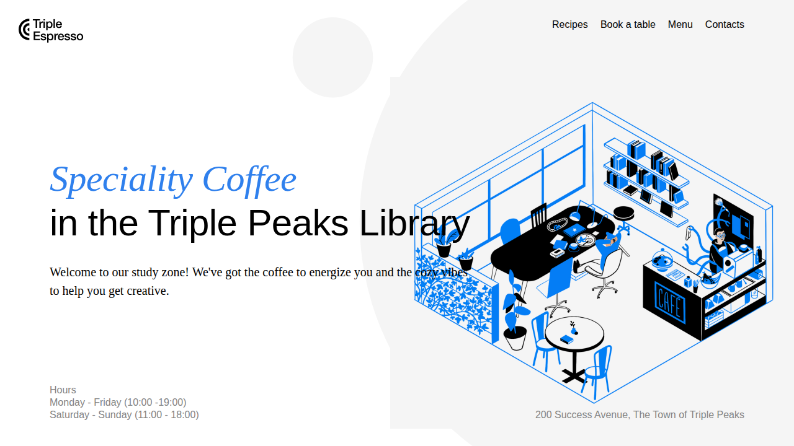
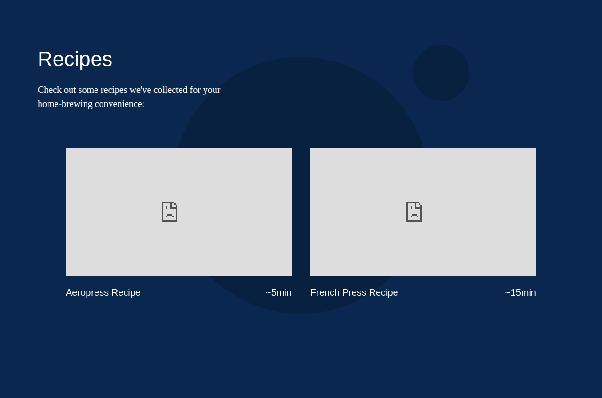
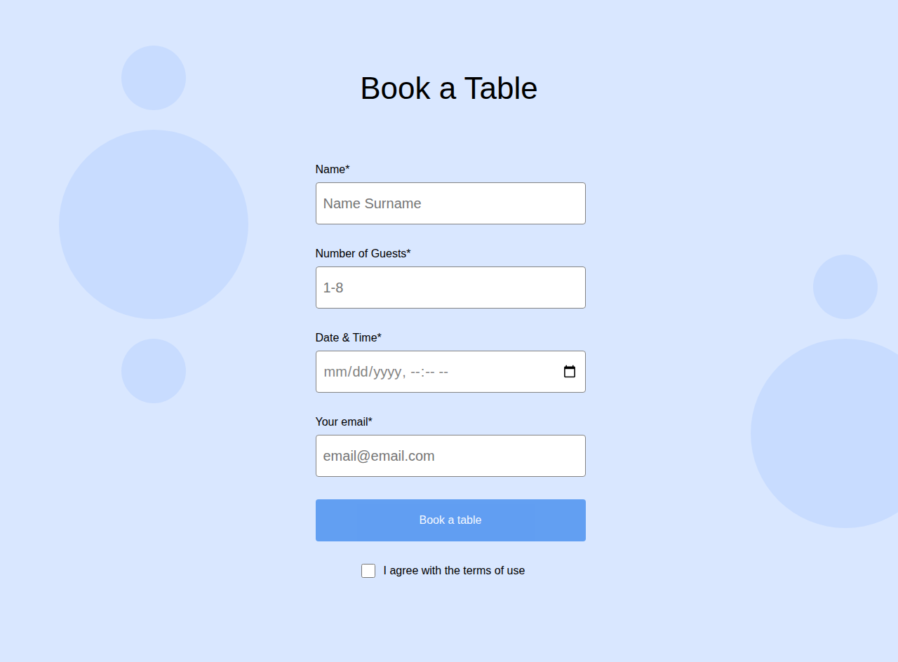
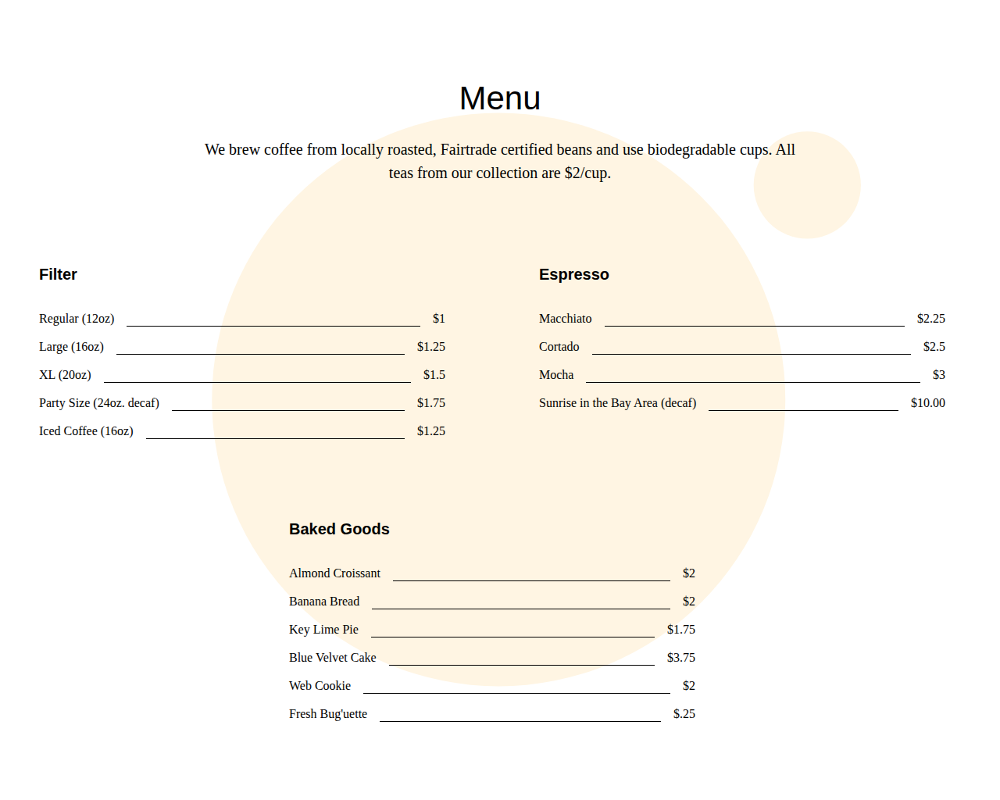
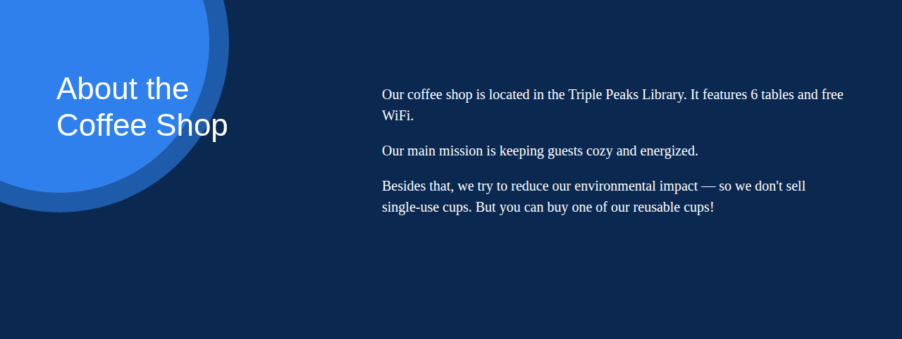

# Coffee Shop ☕️


A responsive coffee shop landing page with a live REST API backend. The frontend fetches menu data dynamically and handles table reservations and contact form submissions via a Node.js/Express/PostgreSQL server.

---

## Project Overview

This project began as a static HTML/CSS landing page and has been extended into a full-stack application. The frontend uses vanilla JavaScript ES modules to communicate with a custom-built REST API. The backend follows an MVC-style architecture with separated routes, controllers, and database logic.

### Frontend

- Responsive landing page built with semantic HTML and BEM-structured CSS
- ES module JavaScript that fetches menu data and submits forms via `fetch()`
- Sections: Hero, Recipes, Book a Table, Menu, Contact, Footer

### Backend

- REST API built with Node.js and Express
- PostgreSQL database with three tables: `reservations`, `menu_items`, `contact_messages`
- MVC pattern: routes handle HTTP wiring, controllers own business logic
- Centralized error handling middleware with proper HTTP status codes
- Input validation utility used across all POST routes

---

## Preview

### Hero Section



### Recipes Section



### Book a Table



### Menu



### About the Coffee Shop



---

## Tech Stack

| Layer       | Technology               |
| ----------- | ------------------------ |
| Markup      | HTML5 (semantic)         |
| Styling     | CSS3, Flexbox, BEM       |
| Frontend JS | Vanilla ES Modules       |
| Backend     | Node.js, Express 5       |
| Database    | PostgreSQL via `pg` Pool |
| Dev tooling | nodemon, dotenv          |

---

## Project Structure

```
se_project_coffeeshop/
├── index.html
├── pages/
│   └── index.css
├── blocks/              ← BEM component CSS files
│   ├── header.css
│   ├── menu.css
│   ├── reservations.css
│   └── ...
├── images/
├── src/
│   ├── index.js         ← Frontend entry point
│   └── utils/
│       └── api.js       ← All fetch calls to the API
├── vendor/
│   └── normalize.css
└── server/
    ├── server.js        ← Express app entry point
    ├── schema.sql       ← Database schema
    ├── .env.example     ← Environment variable template
    ├── package.json
    ├── db/
    │   └── db.js        ← PostgreSQL Pool connection
    ├── routes/
    │   ├── menu.js
    │   ├── reservations.js
    │   └── contact.js
    ├── controllers/
    │   ├── menuController.js
    │   ├── reservationsController.js
    │   └── contactController.js
    ├── middleware/
    │   └── errorHandler.js
    └── utils/
        └── validate.js
```

---

## API Reference

### Menu

| Method | Endpoint    | Description                                          |
| ------ | ----------- | ---------------------------------------------------- |
| GET    | `/menu`     | Returns all available menu items grouped by category |
| POST   | `/menu`     | Add a new menu item                                  |
| PUT    | `/menu/:id` | Update price or availability                         |
| DELETE | `/menu/:id` | Remove a menu item                                   |

### Reservations

| Method | Endpoint        | Description                   |
| ------ | --------------- | ----------------------------- |
| POST   | `/reservations` | Submit a table booking        |
| GET    | `/reservations` | List all reservations (admin) |

### Contact

| Method | Endpoint   | Description              |
| ------ | ---------- | ------------------------ |
| POST   | `/contact` | Submit a contact message |

---

## Getting Started

### Prerequisites

- Node.js v18+
- PostgreSQL running locally

### Backend Setup

```bash
# Navigate to the server directory
cd server

# Install dependencies
npm install

# Set up environment variables
cp .env.example .env
# Edit .env with your PostgreSQL credentials

# Create the database
createdb coffee_shop

# Run the schema
psql -d coffee_shop -f schema.sql

# Start the dev server
npm run dev
```

The API will be available at `http://localhost:5000`.

### Frontend Setup

Open `index.html` directly in a browser or serve it with a local static server:

```bash
# From the project root
npx serve .
```

---

## BEM Methodology

CSS is organized using a flat BEM file structure — one file per block, located in the `blocks/` directory and imported via `pages/index.css`.

- **Block** — standalone component (e.g. `menu`, `header`, `footer`)
- **Element** — part of a block (e.g. `menu__title`, `footer__link`)
- **Modifier** — variation (e.g. `about__circle_animation_blurred`)

---

## Checklist

### Frontend

- [x] Flat BEM file structure
- [x] Menu section dynamically rendered from API
- [x] Reservation form submits to API
- [x] Contact form submits to API
- [x] About section animation
- [x] Semantic HTML throughout

### Backend

- [x] Express server with CORS and JSON middleware
- [x] PostgreSQL schema with three tables
- [x] MVC pattern — routes and controllers separated
- [x] Centralized error handler with HTTP status codes
- [x] Input validation on all POST routes
- [x] 404 handler for unknown routes
- [x] `.env` excluded from version control

### In Progress

- [ ] `loadMenu` null guard for API-down state
- [ ] Seed script for initial menu data
- [ ] Frontend CSS for contact section

---

## Author

**James Holden Moore**

- GitHub: [https://github.com/Jhm323](https://github.com/Jhm323)
- LinkedIn: [https://www.linkedin.com/in/james-holden-moore](https://www.linkedin.com/in/james-holden-moore)
